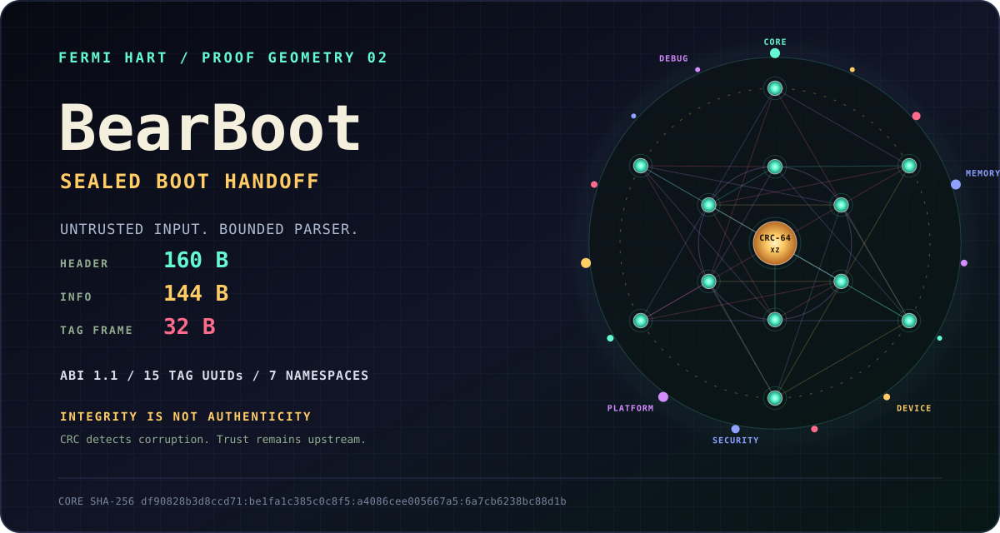

<p align="center">
  <picture>
    <source media="(max-width: 600px)" srcset="readme/hero-proof-geometry-mobile.svg">
    
  </picture>
</p>

# Bear Boot Protocol (BBP)

**A complementary, verifiable boot-handoff layer.** BBP does not replace your
bootloader. It works *alongside* Limine, the UEFI stub, or the native Linux boot
path: it takes the platform data those mechanisms already discovered and
re-expresses it as a tag list that is **UUID-versioned, CRC-64/XZ-sealed, and
parsed by a hardened, adversarial-input-safe consumer.**

```
   Author:  F E R M I  ∞  H A R T  <contact@fermihart.com>
   License: BSD-3-Clause + Patent Grant (see LICENSE)
    Status:  SDK 1.4.0 / BBP wire 1.1 - ABI frozen.
   Release:  sdk-v1.4.0 published with 15 verified assets.
```

> **What BBP is:** a thin integrity + portability layer between *whatever booted
> you* and your kernel. A small frozen ABI (`include/bbp/bbp.h`), a defensive
> kernel-side parser (`kernel/bbp_kernel.c`), a producer-side tag builder
> (`bootloader/bbp_build.c`), and an OS-interface (OSIF) seam so the same core
> drops into different kernels.
>
> **What BBP is not:** a bootloader. It does not own the disk, the ELF loader,
> SMP bring-up, or `ExitBootServices`. Limine / UEFI / the Linux boot path keep
> doing that. BBP rides on top and hands your kernel a checksummed, validated
> view of the result.

---

## Why a complementary layer?

The boot→kernel handoff is the moment a kernel ingests its most security-
critical input (the memory map, ACPI pointers, the command line) — and most
protocols hand it over as **plain, unchecked structs**. A single corrupt or
hostile field there can fault or mislead the kernel before any defenses exist.

BBP adds one honest thing at that seam: **every structure is CRC-64/XZ-sealed,
and the kernel-side parser treats the entire handoff as untrusted input** —
bounds every length, validates structure before dereferencing, rejects
overflowing/wrapping pointers, clamps forged array counts, and bounds cyclic tag
chains. Given the required mapped, readable handoff window that the consumer
keeps immutable during validation, a bad producer can make the kernel *refuse
to boot*; it must not be able to make it fault, hang, or consume forged data.
(See `SECURITY.md`.)

You keep your bootloader. You gain an integrity-checked, portable handoff.

---

## Proven today: four OS integrations

BBP is not a paper ABI. The frozen wire ABI is wired into four different kernels
through the OSIF seam, each with its own producer of tags. Current hosted gates
compile the ports with the core in this checkout; older machine/OS records retain
their historical core provenance and are not proof of an OS boot at current HEAD.

| Integration | How it produces tags | Status |
|-------------|----------------------|--------|
| **`ports/tinalinux/`** | **native** Linux path — `e820_table`, `acpi_os_get_root_pointer()`, `saved_command_line`, `page_offset_base` | current hosted adapter gate; historical external full-OS record in `ports/tinalinux/test/serial.log` is QEMU/KVM emulator evidence, not physical hardware |
| **`ports/minix/`** | **Limine adapter** — translates Limine responses into BBP tags | `serial.log` is a 7-tag adapter machine harness; `serial-all6-consumers.log` is the historical 6-tag full MINIX OS record; neither machine run is replayed by the hosted gate |
| **`ports/linux01/`** | **native identity-mapped adapter** — describes the 1991 fixed RAM model without inventing modern firmware | checked `serial.log` is a hosted 3-tag proof; an in-kernel QEMU boot is reported in the conformance report but its raw serial output is not archived |
| **`ports/josh/`** | **Limine + PMM adapter** — bounded walk window and verified boot-entropy payload | `run.log` is the hosted 6-tag proof; historical external `serial.log` is a 5-tag Josh OS record |

The archived TinaLinux QEMU/KVM record demonstrates the intended integration:
the port sits **next to** the native Linux boot path (does not disturb it), and
at `late_initcall` synthesizes a CRC-sealed tag view of the emulator-provided
firmware tables. Additive, non-fatal, complementary — exactly the design intent.

---

## Layout

```
include/bbp/bbp.h          Canonical frozen ABI: header, info, tag structs.
                           Every struct guarded by _Static_assert(sizeof).
include/bbp/bbp_crc64.h    CRC-64/XZ (ECMA-182), freestanding, header-only.
include/bbp/bbp_osif.h     OS-interface contract: the seam a port implements.
include/bbp/bbp_v2.h       Experimental offline v2 capsule byte layout/API.

kernel/bbp_kernel.{c,h}    Defensive kernel-side parser. HHDM-aware, no libc,
                           treats the whole handoff as untrusted input.
bootloader/bbp_build.{c,h} Producer-side tag builder (arena + CRC sealing).
bootloader/bbp_import*.c   Bounded Limine, Multiboot2, and UEFI translators.
v2/ and bridge/            Freestanding v2 capsule core and explicit v1.1 bridge.
bootloader/efi_main.c      Constrained x86_64 UEFI ELF64 loader proof: three
                           required tags, 4-level paging, OVMF/TCG machine gate.
bootloader/uefi/           Bounded ELF64 and ExitBootServices state machines.

ports/tinalinux/           Native Linux->BBP OSIF (boots under QEMU; see above).
ports/minix/               Limine->BBP adapter OSIF.
ports/linux01/             Identity-mapped adapter for the Linux 0.01 RAM model.
ports/josh/                PMM-backed Josh-Bear adapter with a walk window.

examples/kernel_header.c   A kernel publishing its Bear Header in .bbp_hdr.
examples/sdk_roundtrip.c   Minimal C SDK onboarding + deterministic report.
sdk/c/                     Versioned standalone C SDK package surface.
sdk/rust/bbp-wire/         Dependency-free no_std slice validator crate.
tools/bbp_stamp.py         Post-link header stamper (entry/requests/checksum).
tools/package_sdk.py       Reproducible, allowlisted C + host SDK archives.
tests/                     Host self-test, ABI asserts, parser fuzzer, QEMU rig.
SPEC.md                    Full normative specification.
STATUS.md                  Honest maturity matrix: live / skeleton / roadmap.
docs/adr/                  Architecture Decision Records (the "why").
```

---

## Build & test

```sh
make check         # complete host gate: core, fuzz, importers, tools, SDK, docs
make test          # host-compile + run the self-test (adversarial suite incl.)
make freestanding  # cross-compile the kernel-side as a kernel would (x86_64-elf-)
make fuzz          # parser fuzzer over a malformed-input corpus
make qemu          # build + boot the bare-metal round-trip under QEMU/TCG
make qemu-aarch64  # AArch64 X0 handoff + QEMU Device Tree under TCG
make qemu-riscv64  # RV64 A0 handoff + QEMU Device Tree via OpenSBI
make qemu-uefi     # OVMF-load an x86_64 EFI builder/parser proof under TCG
make qemu-uefi-loader # constrained ELF64 -> EBS -> paging -> RDI kernel proof
make qemu-uefi-tcg2 # live OVMF TCG2 PCR16 + v1.1 SECURITY collector proof
make importers-test # host-test bounded boot-source translation and failures
make bbpctl-test   # verify host capture parsing, evidence, and corrupt fixtures
make v2-test       # adversarial v2 capsule, digest, and v1.1 bridge proof
make v2-profile-test # validate experimental native Profile 0 semantics
make v2-vectors-test # shared 46-case C/Python Draft corpus gate
make v2-fuzz       # bounded malformed capsule + Profile 0 campaign
make tpm2-measure-test # extend the canonical v2 measurement into an emulated TPM2 PCR
make tpm2-nv-response-test # host-test strict TPM2 NV codecs, locking, and recovery
make auth-envelope-test # host-only HMAC authentication and anti-rollback policy
make auth2-test     # independent OpenSSL ECDSA P-256 policy proof
make auth2-freestanding-test # C verifier against the checked-in auth2 vectors
make auth2-portability # link auth2 freestanding for x86_64, AArch64, and RV64
make auth2-sanitize-test # run the C verifier/provider under ASan and UBSan
make auth2-vendor-check # verify every pinned BearSSL source/header checksum
make rollback-test # persistent A/B journal policy with an injected floor
make ports-hosted-check # run all four current-checkout hosted adapter gates
make evidence-check # hosted/emulator/physical evidence-contract tests
make v2-portability # compile the v2 Draft core/bridge for x86_64, AArch64, and RV64
make sdk-check     # extracted C/host packages + no_std Rust parity tests
make sdk-package   # reproducible local archives under build/dist/
```

`make qemu-aarch64` requires `aarch64-linux-gnu-gcc`,
`aarch64-linux-gnu-objcopy`, GNU `timeout`, and `qemu-system-aarch64`.
`make qemu-riscv64` requires `riscv64-linux-gnu-gcc`, GNU `timeout`, and
`qemu-system-riscv64`.

The legacy `make qemu-uefi` target proves PE/COFF loading and executes the real
builder plus bounded parser before `ExitBootServices`. The separate
`make qemu-uefi-loader` gate executes `bootloader/efi_main.c` as a complete proof
of its deliberately constrained x86_64 contract: bounded higher-half ELF64
loading, physically stamped requests, final memory-map/EBS handling, four-level
identity and HHDM paging, three required v1.1 tags, and RDI transfer into the
kernel parser. It is not a general-purpose loader, production firmware, Secure
Boot implementation, or physical-hardware proof.
Its temporary identity/HHDM aliases deliberately do not provide an NX/W^X
security boundary, so this constrained loader rejects kernels that request the
`BBP_HF_ENABLE_NX` contract rather than claiming protection it cannot enforce.
It also rejects non-device memory extending beyond its 4 GiB direct-map
contract during a preflight performed before `ExitBootServices`.

`make qemu-uefi-tcg2` uses OVMF's live `EFI_TCG2_PROTOCOL` and `swtpm` to extend
SHA-256 evidence into PCR 16, publish the frozen v1.1 SECURITY measurement log,
validate its tag and out-of-line CRCs, and independently read back the persistent
emulated PCR. This proves the collector and UEFI/TCG2 path, not firmware identity,
Secure Boot policy, production provisioning, or a physical TPM.

The AArch64 target boots a raw Linux Image on QEMU `virt`, receives its
QEMU-generated Device Tree in X0, copies and CRC-seals it into a v1.1 handoff,
then enters the consumer with INFO in X0. It proves the architecture register
contract and bounded parser on a second ISA; it is not an AArch64 OS port or
firmware loader.

The RV64 target enters through OpenSBI with hart ID in A0 and QEMU's Device
Tree in A1, then re-enters the BearBoot consumer with INFO in A0. Like the
AArch64 target, it is a bounded machine proof, not an OS port or loader.

`tools/bbpctl.py` inspects and verifies host-only `.bbpc` v1 captures and emits
the same canonical evidence stream as the core. BBPC is an archival/test
container, not a boot handoff or preview of the future BBP v2 wire format. See
`docs/bbpc-v1.md`.

The separate BBP v2 contiguous capsule is an offline-only Draft. It does not
change or negotiate the frozen v1.1 ABI. `make v2-test` proves its bounded
parser, deterministic builder, layout-independent digest stream, and explicit
v1.1 bridge. Experimental Profile 0 adds a separate semantic validator without
coupling the generic parser to a registry. A generated positive/negative corpus
pins the current Draft behavior across C, Rust, and an independent Python
validator without freezing the wire; see `docs/rfc/0001-bbp-v2-capsule.md` and
`docs/rfc/0002-bbp-v2-profile-0.md`.

The importer suite translates bounded Limine snapshots, raw Multiboot2 bytes,
and normalized final UEFI snapshots into the same BBP builder. It proves
failure-atomic host translation, not live firmware collection; see
`docs/adr/0011-boot-source-importers.md`.

## SDK onboarding

The C SDK, host tools, and Rust crate share release version `1.4.0`.
The compatible boot wire remains frozen BBP v1.1. The C, host, and Rust package
allowlists now include experimental offline v2/Profile 0/HMAC surfaces and a
shared canonical vector; those APIs remain Draft, are not negotiated from v1.1,
and carry no v2 stability or registry-publication claim. Build the archives,
then exercise the same flow an extracted C consumer runs:

```sh
make sdk-package
make sdk-check
```

Inside the C archive, `make onboarding` compiles the complete SDK and writes a
deterministic `build/conformance.json`. The report is a host builder/parser
profile, not a firmware or machine-boot claim. The `bbp-wire` crate is always
`no_std`, has no dependencies or allocator, validates caller-owned slices, and
never dereferences physical addresses. See `docs/adr/0012-sdk-packaging.md` and
`docs/adr/0019-experimental-v2-sdk-surfaces.md`.

The experimental trust proofs remain outside the stable boot ABI. RFC 0004 and
the auth2 gates prove ECDSA P-256/SHA-256 exact-extent verification and key
policy through independent OpenSSL and freestanding C backends. The C artifact
is closed and cross-compiled for three ISAs, but it has no firmware caller,
provisioning, monotonic provider, or Secure Boot integration. Its zero-copy
views require caller-owned immutable input and DMA exclusion.
`make rollback-test` proves an fsync/replace A/B journal and recovery policy
bounded by a caller-injected monotonic floor. The repository-only
`Tpm2NvFloorProvider` adds a strict, index-authorized TPM2 NV counter client for
a UID-pinned private UNIX endpoint, with exact metadata, bounded responses,
finite provider locking, ambiguous-result reconciliation, and journal
composition tests. The A/B journal retains ADR 0018's cooperating-writer,
indefinitely blocking advisory lock; the provider timeout is not an end-to-end
journal deadline.
`make tpm2-nv-response-test` uses a fake TPM authority plus a real local UNIX
peer-credential check; it requires Linux `SO_PEERCRED`. It does not provision or
execute `swtpm`, authenticate a physical TPM, detect restored daemon state after
restart, or close the online deployment gate. See ADR 0021. The physical runner
contract in `docs/physical-hardware-runner.md` defines how board identity and raw
serial must be captured, but this repository contains no physical PASS proof.

SDK 1.4.0 is published from the signed tag
[`sdk-v1.4.0`](https://github.com/FermiHart/BearBoot/releases/tag/sdk-v1.4.0).
Wave 25's workflow resumed only its matching draft, reconciled the exact 15
allowlisted remote assets, and published only after checksum and Sigstore
verification.

Verify a port against the frozen wire ABI and the core implementation in the
current checkout (example: TinaLinux):

```sh
cd ports/tinalinux
make scaffold-check   # compiles+links the port vs the current core (freestanding)
make test             # hosted: "bbp: tinalinux adapter ok, 5 tags … PASS"
```

---

## The contract in 6 lines

1. The kernel emits a `struct bbp_header` (magic `BEAR_BOOT`) into section
   `.bbp_hdr`, listing the tags it wants (`struct bbp_tag_request[]`).
2. A producer (a bootloader, or an in-kernel adapter like the ports here)
   collects platform data into a `struct bbp_info` (magic `BEAR_INFO`) + a chain
   of tags in an arena, sealing CRC-64 on each tag and on the info.
3. Control reaches the kernel entry with the **physical** info pointer in
   RDI (x86_64) / X0 (AArch64) / A0 (RISC-V).
4. The kernel calls `bbp_init_bounded()` with its mapped tag arena → validates
   magic, version, size and CRC before a bounded HHDM/tag walk.
5. The kernel calls `bbp_find_tag(&k, BBP_TAG_*)` — corrupt tags fail CRC and are
   treated as absent; a forged length can never drive an out-of-bounds read.
6. Out-of-line blobs (cmdline, measurement log, EDID) are verified with
   `bbp_verify_blob()` before they are trusted.

---

## ABI stability

`version_major` bumps on any breaking change. Within a major version, new tags
may be added (kernels ignore unknown tags) and fields may be appended to the END
of a variable-length tag only with a `tag_version` bump, old readers still
parsing the prefix. The `_Static_assert`s in `bbp.h` are the enforcement
mechanism: layout drift fails the **build**, not the boot.

---

## Status & honesty

This project states plainly what is exercised vs. what is structure-only. See
**[STATUS.md](STATUS.md)** for the maturity matrix (the constrained x86_64 OVMF
loader and UEFI/TCG2 SECURITY collector have machine proofs; AArch64 and RV64
have reproducible handoff proofs; LoongArch remains roadmap; no physical run,
Secure Boot chain, firmware P-256 verifier, or physical TPM NV is claimed).
Trust is the product.

— F E R M I  ∞  H A R T
